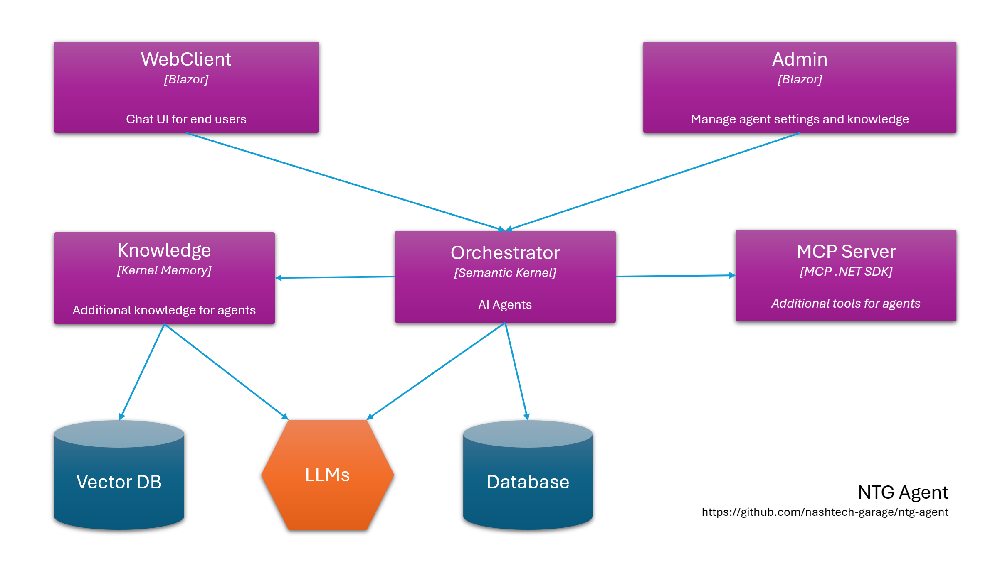

# NTG Agent
This project aims to practice building a chatbot in C#

## High level architecture



## Technologies and frameworks
- .NET 9
- .NET Aspire
- Blazor
- Semantic Kernel
- Kernel Memory
- Support multiple LLMs: GitHub Models, Open AI, Azure Open AI etc.
- SQL Server

## Documentation
Details about the project can be referenced at DeepWiki: https://deepwiki.com/nashtech-garage/ntg-agent

## Getting started

- Setup [GitHub models](https://docs.github.com/en/github-models/use-github-models/prototyping-with-ai-models) (free): Create your Fine-grained personal access tokens in GitHub https://github.com/settings/personal-access-tokens. The token needs to have **models:read** permissions.
- Update file secrets.json for the NTG.Agent.Orchestrator with content below Or run the cli command `dotnet user-secrets set "GitHub:Models:GitHubToken" "<your_token_here>"`. Read [this link](https://learn.microsoft.com/en-us/aspnet/core/security/app-secrets) if you don't know how to set the secrets

```json
{
  "GitHub": {
    "Models": {
      "GitHubToken": "your GitHub token"
    }
  }
}
```

- In the NTG.Agent.Knowledge project, add your GitHub access token and update the database connection string in the secrets.json as below

```json
{
  "KernelMemory": {
    "Services": {
      "OpenAI": {
        "APIKey": "your GitHub token"
      },
      "SqlServer": {
        "ConnectionString": "Server=.;Database=NTGAgent;Trusted_Connection=True;TrustServerCertificate=true;MultipleActiveResultSets=true"
      }
    }
  }
}
```

- In the NTG.Agent.Admin project, update the connection string if needed. Then run Update-Database if you are using Visual Studio, or dotnet ef database update if you are using the CLI.

- Repeat the same step for the NTG.Agent.Orchestrator project.

- Start the NTG.Agent.AppHost, in the Aspire Dashboard you will see resource as below:
  - NTG.Agent.WebClient is the website for end users
  - NTG.Agent.Admin is the website for administrators. The default admin account is admin@ntgagent.com / Ntg@123
  - NTG.Agent.Orchestrator is the backend API
  - NTG.Agent.Knowledge is the service responsible for ingesting documents. It extracts the content of uploaded files, generates embeddings, and stores them in a vector database. It also provides an API to search for relevant documents

## How authentication work

To get started easily, we use the shared cookies approach. In NTG.Agent.Admin, we add YARP as a BFF (Backend for Frontend), which forwards API requests to NTG.Agent.Orchestrator.
Currently, it only works for Blazor WebAssembly. Cookies are not included when the request is made from the server (Blazor).

## Contributing

- Give us a star
- Reporting a bug
- Participate discussions
- Propose new features
- Submit pull requests. If you are new to GitHub, consider to [learn how to contribute to a project through forking](https://docs.github.com/en/get-started/quickstart/contributing-to-projects)

By contributing, you agree that your contributions will be licensed under Apache-2.0 license. 


